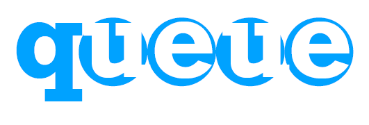

  

## Notes

[E-hälsomyndigheten](https://www.ehalsomyndigheten.se/om-oss/)

## Interoperability
Nationellt patientöversikt  
https://www.inera.se/tjanster/nationell-patientoversikt-npo/Nationell-patientoversikt/#cf79d442-185b-4ce9-b14e-d0d62134188d  
(Kolla priserna! https://www.inera.se/kundservice/priser/#nationell-patientoversikt)

FHIR (API)  
http://hl7.org/fhir/

Inera  
https://www.inera.se/digitalisering/interoperabilitet/

NHSconnect  
https://nhsconnect.github.io/CareConnectAPI/api_workflow_encounter.html

## Business stuff
https://leanstack.com/leancanvas/

## EMR

Cerner  
https://code.cerner.com/start-coding
https://www.cerner.com/se/en/solutions/partners-for-innovation

Cosmic  
https://developer.openservices.cambio.se/faq
